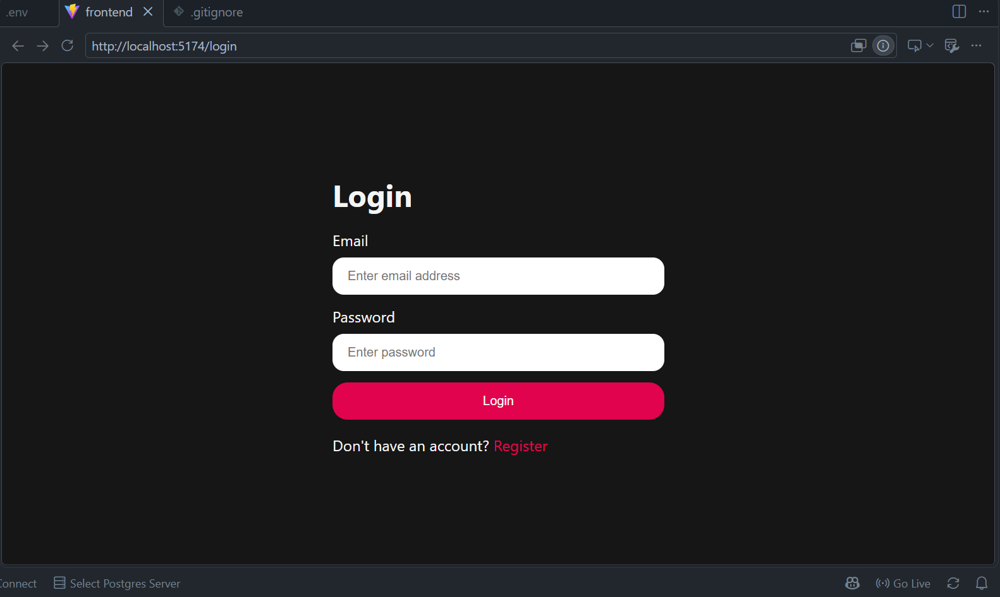
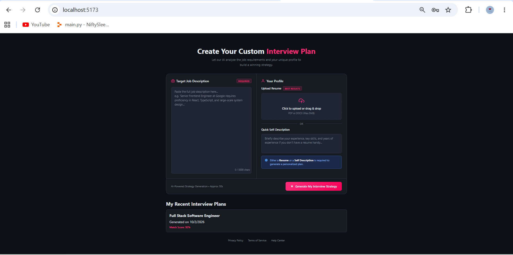
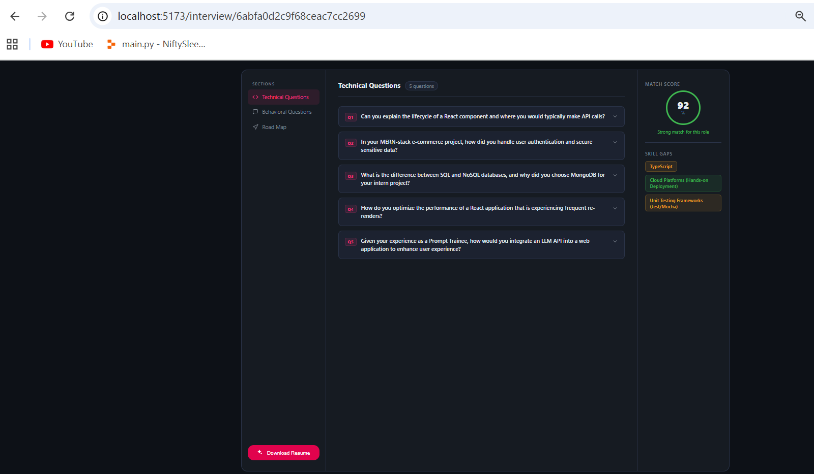

# RoleReady 🚀

> **AI-powered job preparation platform that turns your resume and a target job description into a personalized interview strategy.**

RoleReady is a **Full Stack GenAI Job Preparation Web Application** built to simulate a real-world career preparation product. It combines secure authentication, resume processing, job-description analysis, AI-powered skill-gap detection, personalized interview questions, preparation roadmaps, ATS-focused resume optimization, and dynamic PDF generation.

The project was built to explore how **Full Stack development and Generative AI** can be combined to solve a practical problem: helping candidates prepare more effectively for a specific job instead of relying on generic interview preparation.

---

## ✨ Key Features

### 🔐 Secure Authentication
- User registration and login
- JWT-based authentication
- HTTP-only authentication cookies
- Token blacklisting during logout
- Protected API routes
- Password hashing with `bcryptjs`

### 📄 Resume Processing
- Upload resumes in PDF/DOCX format
- Extract candidate information and skills
- Use resume data as the candidate profile for personalized analysis
- Generate an updated, ATS-oriented resume

### 🎯 Job Description Analysis
- Paste a target job description
- Compare the job requirements against the candidate profile
- Generate a personalized compatibility/match score
- Identify missing or weaker skills

### 🤖 AI-Powered Interview Preparation
- Gemini-powered analysis and content generation
- Technical interview questions
- Behavioral interview questions
- Questions tailored to the target role and candidate background
- Personalized preparation recommendations

### 📊 Skill Gap Detection
RoleReady highlights areas that may need improvement, such as:
- Missing technologies
- Cloud/platform knowledge
- Testing frameworks
- Other role-specific requirements

### 🗺️ Personalized Preparation Roadmap
- Generates a structured preparation plan
- Organizes topics into a day-by-day roadmap
- Covers technical concepts, projects, backend/database topics, AI/tools, and soft skills
- Helps candidates prioritize preparation based on the target role

### 📑 ATS-Optimized Resume Generation
- Uses the analyzed job requirements to improve resume relevance
- Generates an updated resume tailored toward the target role
- Provides a downloadable resume

### 🖨️ Dynamic PDF Generation
- Uses **Puppeteer** to generate PDF output dynamically
- Converts the generated resume into a downloadable document

---

## 🖥️ Application Screenshots

### 🔑 Login



### 📋 Create Your Custom Interview Plan

Users can provide a target job description and upload their resume (or provide a self-description) to generate a personalized interview strategy.



### 📊 Interview Analysis & Match Score

The results page provides a role-specific match score, technical questions, and identified skill gaps.



### 🗺️ Personalized Preparation Roadmap

RoleReady generates a structured preparation roadmap based on the candidate's profile and target role.


---

## 🏗️ How RoleReady Works

```text
                 ┌─────────────────────┐
                 │      Candidate      │
                 └──────────┬──────────┘
                            │
                            ▼
              ┌─────────────────────────┐
              │       React Frontend    │
              │  Auth • Upload • Results│
              └────────────┬────────────┘
                           │
                           │ REST API
                           ▼
              ┌─────────────────────────┐
              │   Node.js + Express.js  │
              │   Controllers + Routes  │
              └───────┬─────────┬───────┘
                      │         │
          ┌───────────┘         └────────────┐
          ▼                                  ▼
┌─────────────────────┐            ┌─────────────────────┐
│      MongoDB        │            │     Gemini API      │
│ Users • Interviews  │            │ AI Analysis +       │
│ Resume/Results Data │            │ Question Generation │
└─────────────────────┘            └──────────┬──────────┘
                                              │
                                              ▼
                                   ┌─────────────────────┐
                                   │      Puppeteer      │
                                   │ Dynamic Resume PDF  │
                                   └─────────────────────┘
```

---

## 🔄 Application Flow

1. **Create an account / Login**
2. **Upload a resume** or provide a candidate self-description
3. **Paste the target job description**
4. RoleReady analyzes the candidate profile against the job requirements
5. **Gemini AI** generates personalized interview preparation content
6. The application calculates/displays a **match score**
7. Missing or weaker skills are highlighted as **skill gaps**
8. Technical and behavioral interview questions are generated
9. A personalized **preparation roadmap** is created
10. The candidate can generate/download an **updated ATS-oriented resume**
11. **Puppeteer** generates the resume PDF

---

## 🛠️ Tech Stack

| Layer | Technology |
|---|---|
| Frontend | React.js |
| Backend | Node.js |
| API Framework | Express.js |
| Database | MongoDB |
| Authentication | JWT |
| Session/Cookie Handling | HTTP Cookies |
| Password Security | bcryptjs |
| AI | Google Gemini API |
| PDF Generation | Puppeteer |
| File Upload | Multer |
| API Communication | Axios |
| Development | Vite |

---

## 🧠 Generative AI Integration

RoleReady uses the **Gemini API** to make the application more than a conventional CRUD-based job portal.

AI is used for tasks such as:

- Understanding job descriptions
- Analyzing candidate profiles
- Identifying skill gaps
- Generating technical interview questions
- Generating behavioral interview questions
- Creating personalized preparation strategies
- Building a structured interview roadmap
- Supporting ATS-focused resume generation

The goal is to make the generated content **specific to the candidate + target job combination**, rather than returning the same generic interview questions for every user.

---

## 🔒 Authentication & Security

RoleReady implements a JWT-based authentication system with additional token invalidation through a blacklist mechanism.

### Authentication Flow

```text
Register / Login
       │
       ▼
Password → bcrypt hash/compare
       │
       ▼
JWT generated
       │
       ▼
Stored in authentication cookie
       │
       ▼
Protected API request
       │
       ▼
JWT verification middleware
       │
       ▼
Authenticated user
```

### Logout Flow

```text
Logout request
      │
      ▼
Read JWT from cookie
      │
      ▼
Add token to blacklist
      │
      ▼
Clear authentication cookie
      │
      ▼
Token can no longer be used
```

---

## 📄 Resume & ATS Optimization

A major part of RoleReady is connecting the candidate's existing resume with the requirements of a specific job.

Instead of simply storing a resume, the application uses the candidate's resume/profile and the target job description to help:

- Identify relevant skills
- Detect skill gaps
- Improve job-specific relevance
- Prepare interview questions
- Generate an updated resume
- Produce a downloadable PDF

This creates a complete workflow from **resume → job analysis → interview preparation → improved resume**.

---

## 📁 Suggested Project Structure

```text
RoleReady/
│
├── frontend/
│   ├── src/
│   │   ├── components/
│   │   ├── pages/
│   │   ├── services/
│   │   ├── hooks/
│   │   └── ...
│   └── package.json
│
├── backend/
│   ├── src/
│   │   ├── controllers/
│   │   ├── routes/
│   │   ├── middleware/
│   │   ├── models/
│   │   ├── services/
│   │   ├── config/
│   │   └── ...
│   └── package.json
│
├── .gitignore
├── README.md
└── ...
```

> The exact structure may vary depending on your final repository organization.

---

## ⚙️ Getting Started

### 1. Clone the repository

```bash
git clone <your-repository-url>
cd RoleReady
```

### 2. Install frontend dependencies

```bash
cd frontend
npm install
```

### 3. Install backend dependencies

```bash
cd ../backend
npm install
```

### 4. Configure environment variables

Create a `.env` file in the backend directory.

Example:

```env
PORT=3000
MONGODB_URI=your_mongodb_connection_string
JWT_SECRET=your_jwt_secret
GEMINI_API_KEY=your_gemini_api_key
```

> Never commit your real `.env` file or API keys to GitHub.

### 5. Start the backend

```bash
npm run dev
```

or, depending on your backend scripts:

```bash
node server.js
```

### 6. Start the frontend

In a separate terminal:

```bash
cd frontend
npm run dev
```

The frontend will normally be available at the local Vite development URL shown in your terminal.

---

## 🌱 Environment Variables

| Variable | Description |
|---|---|
| `PORT` | Backend server port |
| `MONGODB_URI` | MongoDB connection string |
| `JWT_SECRET` | Secret used to sign JWT tokens |
| `GEMINI_API_KEY` | Gemini API key |

---

## 🎯 What This Project Demonstrates

This project demonstrates practical experience with:

- Full Stack application development
- React component-based UI development
- REST API development with Node.js and Express
- MongoDB data modeling
- JWT authentication
- Cookie-based authentication
- Token blacklisting
- Password hashing
- Protected routes and middleware
- File uploads with Multer
- Resume processing
- Generative AI integration
- Prompt-driven AI workflows
- Job-description analysis
- Skill-gap detection
- ATS-oriented resume generation
- Dynamic PDF generation with Puppeteer
- Real-world application architecture
- Frontend/backend API integration

---

## 🚀 Future Improvements

Some potential improvements for future versions:

- [ ] Resume version history
- [ ] Multiple job applications per user
- [ ] Interview answer evaluation using AI
- [ ] Voice-based mock interviews
- [ ] Real-time interview feedback
- [ ] Job tracking dashboard
- [ ] LinkedIn profile analysis
- [ ] More advanced ATS scoring
- [ ] Cloud deployment
- [ ] Rate limiting and additional API security
- [ ] Automated testing
- [ ] CI/CD pipeline

---

## 💡 Why I Built RoleReady

Job preparation is often fragmented across multiple tools: one for resume building, another for interview questions, another for skill-gap analysis, and another for preparation planning.

**RoleReady brings these workflows together into one application.**

The project was also an opportunity to learn how to build a production-style application that combines:

**Full Stack Development + Authentication + File Processing + Generative AI + Resume Engineering + PDF Generation**

---

## 👩‍💻 Author

**Amrita Singh**

Built as a Full Stack + Generative AI project to explore real-world application development and AI-powered career preparation.

---

## ⭐ If You Like This Project

If RoleReady helped you understand Full Stack development or GenAI integration, consider giving the repository a ⭐ on GitHub.
